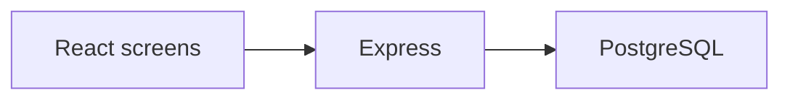

# Architecture — REQ-0002

Locked stack profile: **node**.

## Stack

- Frontend: React
- API: Express
- Data access: Prisma ORM
- Migrations: Prisma Migrate
- Tests: Vitest
- Lint: ESLint + Prettier
- Database: PostgreSQL

## Modules

- `REQ-0002-R01` — REQ-0002-R01
- `REQ-0002-R02` — REQ-0002-R02

## Data model

Entities follow the BRD outline. Shared records have one owning department.

## API contracts

Each module exposes create/read/cancel over HTTPS. Identity is Entra SSO.

## Diagram

## Non-functional

- Browser only. No third runtime.
- Personal data is masked before model egress.

## Source BRD excerpt

# Business Requirements Document — REQ-0002

Objective, page behaviour, data model outline, security design, assumptions,
open questions and testable acceptance criteria. Each requirement carries a
traceability id that tickets, tests, commits and attestations reuse.

## Objective

People stop double-booking rooms.

## Requirements

### REQ-0002-R01

**Source:** approved scope, in-scope item 1.

A web application for Facilities coordinators in Workplace Services., replacing: They book rooms in a shared spreadsheet and double-book <DATE_TIME>.

**Acceptance criteria:**
- A named user can complete this capability in a browser.
- A test can fail this item independently of the others.

### REQ-0002-R02

**Source:** approved scope, in-scope item 2.

Built from the request: Book meeting rooms in a browser. No native apps.

**Acceptance criteria:**
- A named user can complete this capability in a browser.
- A test can fail this item independently of the others.

## Page behaviour

Screens cover each in-scope capability; extra screens are reported at Gate 3.

## Data model outline

PostgreSQL. Entities follow client vocabulary; shared entities have one owning department.

## Security design

Entra SSO. No secrets in images. Personal data masked before model egress.

## Assumptions

- Access is through a browser. Entra identity is the client's.
