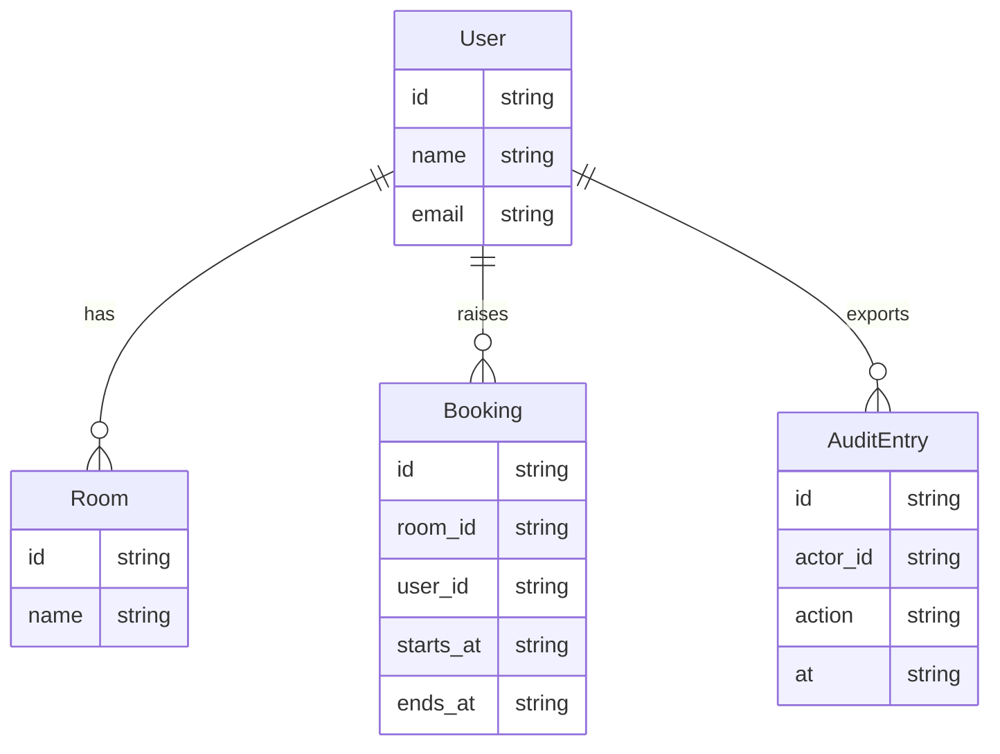

# Functional specification — REQ-0007 — Same-day calendar view (08:00–18:00 weekdays) showing all rooms and

Business requirements and functional specification for Gate 2. Every requirement
has a traceability id reused by tickets, tests, commits and attestations.

## 1. Purpose

Room Booker — <LOCATION> HQ. Facilities coordinators and staff book meeting rooms from a same-day calendar without double-booking. Each slot is held by one person or blocked by facilities. Staff know who holds a room and can contact them. Coordinators can manage bookings and blocks, and staff are notified when their bookings are moved or cancelled.

## 2. Summary

This specification turns the approved Gate 1 scope into a testable product description for **Same-day calendar view (08:00–18:00 weekdays) showing all rooms and**. It is the document Gate 2 signs. Screens at Gate 3 must cover §11.

## 3. Users and roles

Facilities coordinators, named staff, reception (uses coordinator view)

## 4. What happens today

Facilities coordinators and staff book meeting rooms using a shared spreadsheet. Double-bookings occur. No enforcement of time slots or room availability.

## 5. Success

Room Booker — <LOCATION> HQ. Facilities coordinators and staff book meeting rooms from a same-day calendar without double-booking. Each slot is held by one person or blocked by facilities. Staff know who holds a room and can contact them. Coordinators can manage bookings and blocks, and staff are notified when their bookings are moved or cancelled.

## 6. In scope

- Same-day calendar view (08:00–18:00 weekdays) showing all rooms and bookings in a single grid
- Staff create, view, and cancel bookings; choose start/end time in 30-minute steps; see booker name and department on each slot
- Recurring bookings: staff can create series, edit or cancel individual instances, or cancel entire series; edit series start/end from a chosen date forward
- Coordinators view bookings with booker name, creation time, and can cancel or move any booking; moved/cancelled bookings trigger in-app notifications to the original booker (who, old slot, new slot or 'cancelled',…
- Facilities coordinators create, edit, and lift administrative blocks (e.g
- 'Cleaning 12:00–13:00'); blocks appear as first-class holds, colour/label distinguishes Booked from Blocked, reason is visible to all users, staff cannot overwrite blocks, recurring blocks show on matching weekdays
- Session-based authentication: email + password login, demo account creation by office manager, cookie-based sessions with idle timeout
- In-app notifications: staff see cancellation/move notifications on their bookings list; no email or Slack notifications in this version
- Responsive design works in mobile browser

## 7. Out of scope

- Native mobile applications (iOS, Android)
- Desktop applications or installers
- Email or Slack notifications
- SSO, LDAP, Entra, or company directory integration (built-in login only for this version)
- Editing or viewing past bookings
- Cancelling or moving a series without affecting individual instances (series and instance are separate; only individual or whole-series operations allowed)

## 8. Functional requirements

### REQ-0007-R01 — Same-day calendar view (08:00–18:00 weekdays) showing all rooms and bookings…

**Source:** approved scope, in-scope item 1.

Same-day calendar view (08:00–18:00 weekdays) showing all rooms and bookings in a single grid

**Acceptance criteria:**
- **Given** a named user is signed in on a browser
- **When** they same-day calendar view (08:00–18:00 weekdays) showing all rooms and bookings in a single grid
- **Then** the result is visible in the product the same day, without a call, chat or paper register
- **And** an automated test can fail this item without failing the others

### REQ-0007-R02 — Staff create, view, and cancel bookings; choose start/end time in 30-minute…

**Source:** approved scope, in-scope item 2.

Staff create, view, and cancel bookings; choose start/end time in 30-minute steps; see booker name and department on each slot

**Acceptance criteria:**
- **Given** a named user is signed in on a browser
- **When** they staff create, view, and cancel bookings; choose start/end time in 30-minute steps; see booker name and department on each slot
- **Then** the result is visible in the product the same day, without a call, chat or paper register
- **And** an automated test can fail this item without failing the others

### REQ-0007-R03 — Recurring bookings: staff can create series, edit or cancel individual…

**Source:** approved scope, in-scope item 3.

Recurring bookings: staff can create series, edit or cancel individual instances, or cancel entire series; edit series start/end from a chosen date forward

**Acceptance criteria:**
- **Given** a named user is signed in on a browser
- **When** they recurring bookings: staff can create series, edit or cancel individual instances, or cancel entire series; edit series start/end from a chosen date forward
- **Then** the result is visible in the product the same day, without a call, chat or paper register
- **And** an automated test can fail this item without failing the others

### REQ-0007-R04 — Coordinators view bookings with booker name, creation time, and can cancel or…

**Source:** approved scope, in-scope item 4.

Coordinators view bookings with booker name, creation time, and can cancel or move any booking; moved/cancelled bookings trigger in-app notifications to the original booker (who, old slot, new slot or 'cancelled',…

**Acceptance criteria:**
- **Given** a named user is signed in on a browser
- **When** they coordinators view bookings with booker name, creation time, and can cancel or move any booking; moved/cancelled bookings trigger in-app notifications to the original booker (who, old slot, new slot or 'cancelled',…
- **Then** the result is visible in the product the same day, without a call, chat or paper register
- **And** an automated test can fail this item without failing the others

### REQ-0007-R05 — Facilities coordinators create, edit, and lift administrative blocks (e.g

**Source:** approved scope, in-scope item 5.

Facilities coordinators create, edit, and lift administrative blocks (e.g

**Acceptance criteria:**
- **Given** a named user is signed in on a browser
- **When** they facilities coordinators create, edit, and lift administrative blocks (e.g
- **Then** the result is visible in the product the same day, without a call, chat or paper register
- **And** an automated test can fail this item without failing the others

### REQ-0007-R06 — 'Cleaning 12:00–13:00'); blocks appear as first-class holds, colour/label…

**Source:** approved scope, in-scope item 6.

'Cleaning 12:00–13:00'); blocks appear as first-class holds, colour/label distinguishes Booked from Blocked, reason is visible to all users, staff cannot overwrite blocks, recurring blocks show on matching weekdays

**Acceptance criteria:**
- **Given** a named user is signed in on a browser
- **When** they 'Cleaning 12:00–13:00'); blocks appear as first-class holds, colour/label distinguishes Booked from Blocked, reason is visible to all users, staff cannot overwrite blocks, recurring blocks show on matching weekdays
- **Then** the result is visible in the product the same day, without a call, chat or paper register
- **And** an automated test can fail this item without failing the others

### REQ-0007-R07 — Session-based authentication: email + password login, demo account creation by…

**Source:** approved scope, in-scope item 7.

Session-based authentication: email + password login, demo account creation by office manager, cookie-based sessions with idle timeout

**Acceptance criteria:**
- **Given** a named user is signed in on a browser
- **When** they session-based authentication: email + password login, demo account creation by office manager, cookie-based sessions with idle timeout
- **Then** the result is visible in the product the same day, without a call, chat or paper register
- **And** an automated test can fail this item without failing the others

### REQ-0007-R08 — In-app notifications: staff see cancellation/move notifications on their…

**Source:** approved scope, in-scope item 8.

In-app notifications: staff see cancellation/move notifications on their bookings list; no email or Slack notifications in this version

**Acceptance criteria:**
- **Given** a named user is signed in on a browser
- **When** they in-app notifications: staff see cancellation/move notifications on their bookings list; no email or Slack notifications in this version
- **Then** the result is visible in the product the same day, without a call, chat or paper register
- **And** an automated test can fail this item without failing the others

### REQ-0007-R09 — Responsive design works in mobile browser

**Source:** approved scope, in-scope item 9.

Responsive design works in mobile browser

**Acceptance criteria:**
- **Given** a named user is signed in on a browser
- **When** they responsive design works in mobile browser
- **Then** the result is visible in the product the same day, without a call, chat or paper register
- **And** an automated test can fail this item without failing the others

## 9. Non-functional requirements

- **Channel:** responsive website. Phone and laptop browser. No app-store install.
- **Stack:** React frontend; Node.js or Python backend, locked at Gate 3; PostgreSQL.
- **Access:** work login in the browser. No secrets in images.
- **Data:** personal data stays in the tenant; mask it before any model egress.
- **Same-day:** a completed action is visible to the named reviewer without a side channel.
- **Accessibility:** keyboard reachable, labelled fields, contrast from the design system.

## 10. User journeys

Staff sign in, complete the in-scope work, and a reviewer can see the outcome without a side channel.

```mermaid
flowchart LR
  SignIn[Sign in] --> SameDayCalendar
  SameDayCalendar --> StaffCreateView
  StaffCreateView --> RecurringBookingsStaff
  RecurringBookingsStaff --> CoordinatorsViewBookings
  CoordinatorsViewBookings --> FacilitiesCoordinatorsCreate
  FacilitiesCoordinatorsCreate --> CleaningBlocksAppear
  CleaningBlocksAppear --> SessionBasedAuthentication
  SessionBasedAuthentication --> InAppNotifications
  InAppNotifications --> ResponsiveDesignWorks
```

Primary path: Sign in → SameDayCalendar --> StaffCreateView --> RecurringBookingsStaff --> CoordinatorsViewBookings --> FacilitiesCoordinatorsCreate --> CleaningBlocksAppear --> SessionBasedAuthentication --> InAppNotifications --> ResponsiveDesignWorks.

## 11. Page behaviour

Screens the UI/UX agent must cover. A page with no screen is a gap at Gate 3.

- **SameDayCalendar**: Same-day calendar view (08:00–18:00 weekdays) showing all rooms and bookings in a single grid
- **StaffCreateView**: Staff create, view, and cancel bookings; choose start/end time in 30-minute steps; see booker name and department on each slot
- **RecurringBookingsStaff**: Recurring bookings: staff can create series, edit or cancel individual instances, or cancel entire series; edit series start/end from a…
- **CoordinatorsViewBookings**: Coordinators view bookings with booker name, creation time, and can cancel or move any booking; moved/cancelled bookings trigger in-app…
- **FacilitiesCoordinatorsCreate**: Facilities coordinators create, edit, and lift administrative blocks (e.g
- **CleaningBlocksAppear**: 'Cleaning 12:00–13:00'); blocks appear as first-class holds, colour/label distinguishes Booked from Blocked, reason is visible to all…
- **SessionBasedAuthentication**: Session-based authentication: email + password login, demo account creation by office manager, cookie-based sessions with idle timeout
- **InAppNotifications**: In-app notifications: staff see cancellation/move notifications on their bookings list; no email or Slack notifications in this version
- **ResponsiveDesignWorks**: Responsive design works in mobile browser

## 12. Data model

PostgreSQL. One owning department per shared entity. Fields below are the minimum the screens need.

- **User:** id, name, email
- **Room:** id, name
- **Booking:** id, room_id, user_id, starts_at, ends_at
- **AuditEntry:** id, actor_id, action, at

## 13. Security design

Work login in the browser. Role-appropriate views (staff vs manager). No secrets in images. Personal data stays in the tenant and is masked before model egress.

## 14. Integrations

- Browser only for this release.
- Spreadsheet / CSV export if in scope; no payroll feed unless listed in §6.
- Calendar or directory systems are open questions until named in §16.

## 15. Assumptions

- All users (staff and coordinators) are employees of the company and will be created in the system by the office manager or a coordinator
- Rooms are pre-configured in the system (not created by users)
- A booking occupies a room for a contiguous time block; no split or multi-room bookings
- Facilities blocks are created by coordinators only; staff cannot see or interact with block creation
- The app runs on modern browsers (Chrome, Firefox, Safari, Edge); no legacy browser support required
- Idle timeout duration and exact session expiry policy to be confirmed

## 16. Open questions

- What is the exact idle timeout duration for sessions?
- How many rooms are in scope for <LOCATION> HQ, and are they pre-configured or created by users?
- Should the calendar show a time grid (e.g. 30-minute slots) or a list view, or both?
- When a coordinator moves a booking to a new time, can they move it to a different room, or only within the same room?
- Do recurring bookings have an end date, or can they repeat indefinitely?
- Should staff see the full booking history (past and future), or only current and future bookings?

## 17. Traceability

Each id in §8 is the source of tickets, tests and attestations. Do not invent
requirements that are not listed there.
- *(critique)* Confirm the owning department for shared records before decomposition.
