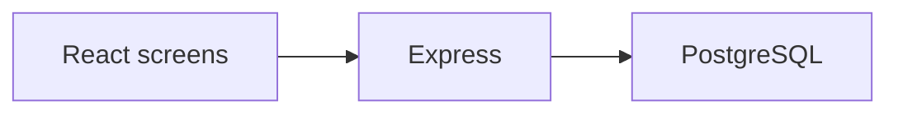

# Architecture — REQ-0010

Locked stack profile: **node**.

## Stack

- Frontend: React
- API: Express
- Data access: Prisma ORM
- Migrations: Prisma Migrate
- Tests: Vitest
- Lint: ESLint + Prettier
- Database: PostgreSQL

## Modules

- `StaffCanBook` — Room-selector, date-picker, start-time and end-time inputs, and a Submit button. On submit, clash detection runs server-side; success inserts the new booking into the same-day list in place; failure surfaces a conflict banner naming the clashing interval. No page reload on either path.
- `StaffCanCreate` — Extends the booking form with a recurrence panel (frequency selector, end-date for the series). Preview shows the first and last occurrence before confirm. On save, all occurrences are written atomically. A "Manage series" view lists occurrences with per-occurrence and whole-series cancel controls.
- `StaffCanExtend` — Accessed from an existing booking or series detail. Shows current end time (or series end date) with an editable field. On submit, clash detection covers the extended interval only; conflict or success feedback appears in place.
- `ClashDetectionThe` — Not a standalone screen — clash feedback is an inline banner on StaffCanBook, StaffCanCreate, and StaffCanExtend. Banner text identifies the room, the conflicting interval, and whether the conflict is a booking or a maintenance block.
- `FacilitiesCoordinatorSees` — Full-width same-day list, sorted by start time. Each row: room name, time interval, staff name (bookings) or "Maintenance" (blocks), status chip (Booked / Blocked). Auto-refreshes in place; no manual reload needed. Coordinator can initiate a maintenance block from this view.
- `FacilitiesCoordinatorCan` — Modal or inline form on the same-day list: room selector, date (defaults to today), start time, end time, optional note. On save, the block appears immediately in the list and clash detection is active for the interval.
- `CalendarUpdatesIn` — Not a standalone screen — a cross-cutting behaviour. After any write action the same-day list patch is applied client-side within 2 seconds. A loading indicator is shown during the round-trip; no spinner persists beyond 2 seconds on a normal connection.
- `OfficeManagerCan` — User-management screen listing current staff accounts (name, email, role). "Add login" form: name, email, temporary password. "Remove" action with a confirmation step. Removed accounts are deactivated immediately.
- `LoginViaEmail` — Single-screen login: email field, password field, Sign In button. No SSO button, no social login. Failed authentication shows a generic error (no account enumeration). Successful login redirects to the role-appropriate landing view.
- `ResponsiveDesignStaff` — Not a standalone screen — a cross-cutting constraint. All screens above must render usably at 320 px and above. Touch targets ≥ 44 px. No action hidden behind a hover state.

## Data model

Entities follow the BRD outline. Shared records have one owning department.

## API contracts

Each module exposes create/read/cancel over HTTPS. Identity is Entra SSO.

## Diagram

## Non-functional

- Browser only. No third runtime.
- Personal data is masked before model egress.

## Source BRD excerpt

# Business Requirements Document — REQ-0010

## Objective

Replace the shared spreadsheet used for meeting-room bookings with a responsive web application that prevents double-booking through real-time clash detection, gives the facilities coordinator a live same-day schedule, lets the office manager control staff access, and supports recurring bookings and maintenance blocks — all without SSO, native apps, or physical-access integration.

## Requirements

### REQ-0010-R01 — Single-slot booking

Staff can book a single meeting room slot by selecting room, date, and time.

- **Given** a staff member is signed in
- **When** they select a room, date, start time, and end time and submit
- **Then** the booking is saved, appears immediately in the same-day list, and no other staff member can book the same room for any overlapping period
- **And** an automated test can fail this requirement without failing any other

### REQ-0010-R02 — Recurring booking

Staff can create a recurring booking (same room, same time, for a date range) and cancel the entire series or individual occurrences.

- **Given** a staff member is signed in
- **When** they define a recurrence pattern (room, time, frequency, date range) and submit
- **Then** all occurrences are saved; the staff member can subsequently cancel the whole series or a single occurrence; past occurrences are preserved in history when a future-only cancellation is applied
- **And** an automated test can fail this requirement without failing any other

### REQ-0010-R03 — Extend booking or series

Staff can extend an existing single booking or every future occurrence in a recurring series.

- **Given** a staff member owns an existing booking or series
- **When** they submit an extension (later end time, or extended date range for a series)
- **Then** clash detection runs against the extended period; if no clash, the booking or all future occurrences are updated; if a clash exists, the extension is refused with a clear message
- **

## Architect notes

# Architecture Note — Meeting Room Booking System

## Modules

- **Authentication & User Management**: Handles email/password login, role-based access (staff, coordinator, manager), and account lifecycle (creation, removal, activation).
- **Booking Management**: Supports single and recurring bookings, extensions, cancellations, and enforces booking status.
- **Maintenance Blocks**: Allows coordinators to create time blocks that prevent bookings.
- **Clash Detection**: Centralized logic to detect overlapping bookings or blocks, preventing double-booking.
- **Same-Day Schedule View**: Real-time, auto-updating list of bookings and blocks for coordinators.
- **UI Layer**: Responsive web frontend with forms and views for booking, management, and calendar updates.
- **Audit Logging**: Records user actions for accountability and traceability.

## Non-Functional Requirements (NFRs)

- **Responsiveness**: UI updates (e.g., same-day list) must reflect changes within 2 seconds without full page reloads.
- **Scalability**: Efficient clash detection queries to handle concurrent booking attempts without race conditions.
- **Security**: Password-based authentication only; no SSO or external identity providers; role-based access control enforced.
- **Usability**: Responsive design supporting mobile and desktop with accessible touch targets and no horizontal scrolling.
- **Reliability**: Prevent double-booking and ensure data consistency, especially for recurring bookings and extensions.
- **Testability**: Each requirement supports isolated automated tests that can fail independently.

## Risks

- **Race Conditions in Clash Detection**: Concurrent booking attempts may cause conflicts; requires transactional integrity or optimistic locking.
- **Recurring Booking Complexity**: Managing series updates, cancellations, and history preservation can introduce edge cases.
- **Real-Time UI Updates**: Ensuring timely and consistent in-place calendar updates under varying network conditions.
- **User Management Consistency**: Removing users must not orphan bookings; requires careful cascade or validation logic.
- **Performance Under Load**: Clash detection and calendar updates must remain performant as booking volume grows.

This architecture favors modular separation of concerns, transactional integrity for booking operations, and a reactive UI to meet responsiveness and usability goals.
