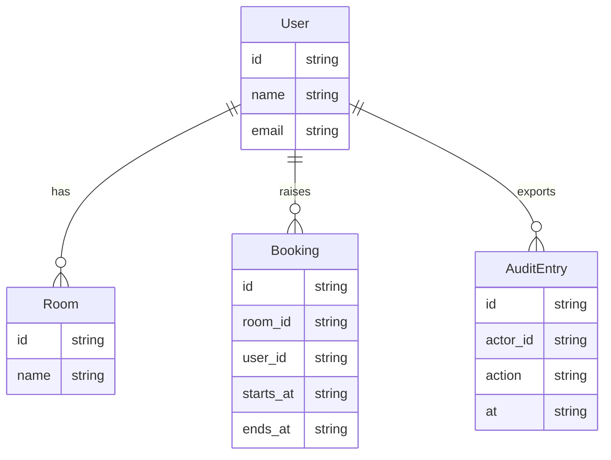

# Functional specification — REQ-0023 — Calendar view showing room availability in 15-minute increments,

Business requirements and functional specification for Gate 2. Every requirement
has a traceability id reused by tickets, tests, commits and attestations.

## 1. Purpose

Meeting Room Booking System. Staff book rooms without spreadsheet coordination. Office manager sees real-time occupancy and no-show patterns without manual tracking. Facilities coordinators can override holds with audit trail. No double-bookings occur.

## 2. Summary

This specification turns the approved Gate 1 scope into a testable product description for **Calendar view showing room availability in 15-minute increments,**. It is the document Gate 2 signs. Screens at Gate 3 must cover §11.

## 3. Users and roles

Office staff (bookers), office manager, reception, facilities coordinators

## 4. What happens today

Staff coordinate room bookings via shared spreadsheet. No visibility into real-time availability. Office manager manually tracks occupancy and no-shows.

## 5. Success

Meeting Room Booking System. Staff book rooms without spreadsheet coordination. Office manager sees real-time occupancy and no-show patterns without manual tracking. Facilities coordinators can override holds with audit trail. No double-bookings occur.

## 6. In scope

- Calendar view showing room availability in 15-minute increments, 08:00–18:00 weekdays only
- Staff can book any start/end time within building hours, max 4 hours per booking (coordinators can extend)
- Conflict detection: reject overlapping bookings, show who holds the room and until when, offer next three free windows
- Booking cancellation: immediate slot release, no-shows under 15 minutes logged for facilities review
- Recurring weekly bookings (staff can create, edit, cancel series)
- Office manager dashboard: all rooms, occupancy status (confirmed/cancelled/no-show), today's view with 15–30 second polling
- Office manager can edit/cancel any booking, move bookings between rooms, add walk-in holds
- 90-day booking history filterable by room and person, exportable as CSV
- Weekly summary: booking count, cancellations under 15 minutes, empty-room holds
- Role-based access: staff see only their own bookings; reception and coordinators see full board; only coordinators can bump existing bookings with logged reason

## 7. Out of scope

- Native mobile app or app-store release (browser only)
- All-day blocks (unless facilities coordinator creates them manually)
- Live websocket push for calendar updates (polling acceptable)
- Advanced analytics or forecasting
- Integration with external calendar systems (e.g., Outlook, Google Calendar)
- Email or SMS notifications

## 8. Functional requirements

### REQ-0023-R01 — Calendar view showing room availability in 15-minute increments, 08:00–18:00…

**Source:** approved scope, in-scope item 1.

Calendar view showing room availability in 15-minute increments, 08:00–18:00 weekdays only

**Acceptance criteria:**
- **Given** a named user is signed in on a browser
- **When** they calendar view showing room availability in 15-minute increments, 08:00–18:00 weekdays only
- **Then** the result is visible in the product the same day, without a call, chat or paper register
- **And** an automated test can fail this item without failing the others

### REQ-0023-R02 — Staff can book any start/end time within building hours, max 4 hours per…

**Source:** approved scope, in-scope item 2.

Staff can book any start/end time within building hours, max 4 hours per booking (coordinators can extend)

**Acceptance criteria:**
- **Given** a named user is signed in on a browser
- **When** they staff can book any start/end time within building hours, max 4 hours per booking (coordinators can extend)
- **Then** the result is visible in the product the same day, without a call, chat or paper register
- **And** an automated test can fail this item without failing the others

### REQ-0023-R03 — Conflict detection: reject overlapping bookings, show who holds the room and…

**Source:** approved scope, in-scope item 3.

Conflict detection: reject overlapping bookings, show who holds the room and until when, offer next three free windows

**Acceptance criteria:**
- **Given** a named user is signed in on a browser
- **When** they conflict detection: reject overlapping bookings, show who holds the room and until when, offer next three free windows
- **Then** the result is visible in the product the same day, without a call, chat or paper register
- **And** an automated test can fail this item without failing the others

### REQ-0023-R04 — Booking cancellation: immediate slot release, no-shows under 15 minutes logged…

**Source:** approved scope, in-scope item 4.

Booking cancellation: immediate slot release, no-shows under 15 minutes logged for facilities review

**Acceptance criteria:**
- **Given** a named user is signed in on a browser
- **When** they booking cancellation: immediate slot release, no-shows under 15 minutes logged for facilities review
- **Then** the result is visible in the product the same day, without a call, chat or paper register
- **And** an automated test can fail this item without failing the others

### REQ-0023-R05 — Recurring weekly bookings (staff can create, edit, cancel series)

**Source:** approved scope, in-scope item 5.

Recurring weekly bookings (staff can create, edit, cancel series)

**Acceptance criteria:**
- **Given** a named user is signed in on a browser
- **When** they recurring weekly bookings (staff can create, edit, cancel series)
- **Then** the result is visible in the product the same day, without a call, chat or paper register
- **And** an automated test can fail this item without failing the others

### REQ-0023-R06 — Office manager dashboard: all rooms, occupancy status…

**Source:** approved scope, in-scope item 6.

Office manager dashboard: all rooms, occupancy status (confirmed/cancelled/no-show), today's view with 15–30 second polling

**Acceptance criteria:**
- **Given** a named user is signed in on a browser
- **When** they office manager dashboard: all rooms, occupancy status (confirmed/cancelled/no-show), today's view with 15–30 second polling
- **Then** the result is visible in the product the same day, without a call, chat or paper register
- **And** an automated test can fail this item without failing the others

### REQ-0023-R07 — Office manager can edit/cancel any booking, move bookings between rooms, add…

**Source:** approved scope, in-scope item 7.

Office manager can edit/cancel any booking, move bookings between rooms, add walk-in holds

**Acceptance criteria:**
- **Given** a named user is signed in on a browser
- **When** they office manager can edit/cancel any booking, move bookings between rooms, add walk-in holds
- **Then** the result is visible in the product the same day, without a call, chat or paper register
- **And** an automated test can fail this item without failing the others

### REQ-0023-R08 — 90-day booking history filterable by room and person, exportable as CSV

**Source:** approved scope, in-scope item 8.

90-day booking history filterable by room and person, exportable as CSV

**Acceptance criteria:**
- **Given** a named user is signed in on a browser
- **When** they 90-day booking history filterable by room and person, exportable as CSV
- **Then** the result is visible in the product the same day, without a call, chat or paper register
- **And** an automated test can fail this item without failing the others

### REQ-0023-R09 — Weekly summary: booking count, cancellations under 15 minutes, empty-room holds

**Source:** approved scope, in-scope item 9.

Weekly summary: booking count, cancellations under 15 minutes, empty-room holds

**Acceptance criteria:**
- **Given** a named user is signed in on a browser
- **When** they weekly summary: booking count, cancellations under 15 minutes, empty-room holds
- **Then** the result is visible in the product the same day, without a call, chat or paper register
- **And** an automated test can fail this item without failing the others

### REQ-0023-R10 — Role-based access: staff see only their own bookings; reception and…

**Source:** approved scope, in-scope item 10.

Role-based access: staff see only their own bookings; reception and coordinators see full board; only coordinators can bump existing bookings with logged reason

**Acceptance criteria:**
- **Given** a named user is signed in on a browser
- **When** they role-based access: staff see only their own bookings; reception and coordinators see full board; only coordinators can bump existing bookings with logged reason
- **Then** the result is visible in the product the same day, without a call, chat or paper register
- **And** an automated test can fail this item without failing the others

## 9. Non-functional requirements

- **Channel:** responsive website. Phone and laptop browser. No app-store install.
- **Stack:** React frontend; Node.js or Python backend, locked at Gate 3; PostgreSQL.
- **Access:** work login in the browser. No secrets in images.
- **Data:** personal data stays in the tenant; mask it before any model egress.
- **Same-day:** a completed action is visible to the named reviewer without a side channel.
- **Accessibility:** keyboard reachable, labelled fields, contrast from the design system.

## 10. User journeys

Staff sign in, complete the in-scope work, and a reviewer can see the outcome without a side channel.

```mermaid
flowchart LR
  SignIn[Sign in] --> CalendarViewShowing
  CalendarViewShowing --> StaffCanBook
  StaffCanBook --> ConflictDetectionReject
  ConflictDetectionReject --> BookingCancellationImmediate
  BookingCancellationImmediate --> RecurringWeeklyBookings
  RecurringWeeklyBookings --> OfficeManagerDashboard
  OfficeManagerDashboard --> OfficeManagerCan
  OfficeManagerCan --> DayBookingHistory
  DayBookingHistory --> WeeklySummaryBooking
  WeeklySummaryBooking --> RoleBasedAccess
```

Primary path: Sign in → CalendarViewShowing --> StaffCanBook --> ConflictDetectionReject --> BookingCancellationImmediate --> RecurringWeeklyBookings --> OfficeManagerDashboard --> OfficeManagerCan --> DayBookingHistory --> WeeklySummaryBooking --> RoleBasedAccess.

## 11. Page behaviour

Screens the UI/UX agent must cover. A page with no screen is a gap at Gate 3.

- **CalendarViewShowing**: Calendar view showing room availability in 15-minute increments, 08:00–18:00 weekdays only
- **StaffCanBook**: Staff can book any start/end time within building hours, max 4 hours per booking (coordinators can extend)
- **ConflictDetectionReject**: Conflict detection: reject overlapping bookings, show who holds the room and until when, offer next three free windows
- **BookingCancellationImmediate**: Booking cancellation: immediate slot release, no-shows under 15 minutes logged for facilities review
- **RecurringWeeklyBookings**: Recurring weekly bookings (staff can create, edit, cancel series)
- **OfficeManagerDashboard**: Office manager dashboard: all rooms, occupancy status (confirmed/cancelled/no-show), today's view with 15–30 second polling
- **OfficeManagerCan**: Office manager can edit/cancel any booking, move bookings between rooms, add walk-in holds
- **DayBookingHistory**: 90-day booking history filterable by room and person, exportable as CSV
- **WeeklySummaryBooking**: Weekly summary: booking count, cancellations under 15 minutes, empty-room holds
- **RoleBasedAccess**: Role-based access: staff see only their own bookings; reception and coordinators see full board; only coordinators can bump existing…

## 12. Data model

PostgreSQL. One owning department per shared entity. Fields below are the minimum the screens need.

- **User:** id, name, email
- **Room:** id, name
- **Booking:** id, room_id, user_id, starts_at, ends_at
- **AuditEntry:** id, actor_id, action, at

## 13. Security design

Work login in the browser. Role-appropriate views (staff vs manager). No secrets in images. Personal data stays in the tenant and is masked before model egress.

## 14. Integrations

- Browser only for this release.
- Spreadsheet / CSV export if in scope; no payroll feed unless listed in §6.
- Calendar or directory systems are open questions until named in §16.

## 15. Assumptions

- Rooms are pre-configured in the system (not user-created)
- Staff have existing user accounts or will authenticate via a simple login
- Facilities coordinators are a defined role with override permissions
- No integration with external systems (Outlook, Google Calendar, etc.)
- CSV export is a download, not scheduled delivery

## 16. Open questions

- How many rooms and staff members are we starting with? (Affects initial data load and performance tuning.)
- Should staff receive any notification when their booking is cancelled or bumped by a coordinator?
- For recurring weekly bookings, what happens if a single instance is cancelled — does it break the series or skip just that week?
- Who creates user accounts and assigns roles (office manager, coordinator, staff)? Is there a self-signup flow or admin-only provisioning?

## 17. Traceability

Each id in §8 is the source of tickets, tests and attestations. Do not invent
requirements that are not listed there.
- *(critique)* Confirm the owning department for shared records before decomposition.
